# Database ER Diagram

## Entity Relationship Diagram

```mermaid
erDiagram
    USERS ||--o{ AUDIT_LOGS : creates
    USERS ||--o{ BLOGS : authors
    USERS ||--o{ PROJECTS : manages
    USERS ||--o{ PRODUCTS : manages
    
    ROLES ||--|{ USERS : assigns
    ROLES ||--|{ PERMISSIONS : contains
    
    PRODUCTS ||--|{ PRODUCT_IMAGES : contains
    PRODUCTS ||--o{ DOWNLOADS : has
    
    SERVICES ||--o{ PROJECTS : includes
    
    PROJECTS ||--|{ PROJECT_IMAGES : contains
    PROJECTS ||--o{ DOWNLOADS : has
    
    BLOGS ||--|{ BLOG_CATEGORIES : belongs_to
    BLOGS ||--|{ BLOG_TAGS : tagged_with
    BLOGS ||--o{ BLOG_VIEWS : tracks
    
    CAREERS ||--|{ JOB_APPLICATIONS : receives
    
    CONTACTS ||--o{ CONTACT_FOLLOWUPS : generates
    
    PARTNERS ||--o{ TESTIMONIALS : provides
    
    SEO_METADATA ||--|| PRODUCTS : optimizes
    SEO_METADATA ||--|| BLOGS : optimizes
    SEO_METADATA ||--|| PROJECTS : optimizes
    SEO_METADATA ||--|| SERVICES : optimizes

    USERS {
        uuid id PK
        string email UK
        string password_hash
        string first_name
        string last_name
        uuid role_id FK
        boolean is_active
        timestamp created_at
        timestamp updated_at
    }
    
    ROLES {
        uuid id PK
        string name UK
        string description
        json permissions
        timestamp created_at
    }
    
    PERMISSIONS {
        uuid id PK
        string name UK
        string resource
        string action
        timestamp created_at
    }
    
    PRODUCTS {
        uuid id PK
        string product_id UK
        string name
        string category
        text description
        json specifications
        json features
        json applications
        string status
        uuid seo_metadata_id FK
        timestamp created_at
        timestamp updated_at
    }
    
    PRODUCT_IMAGES {
        uuid id PK
        uuid product_id FK
        string image_url
        integer display_order
        boolean is_primary
        timestamp created_at
    }
    
    SERVICES {
        uuid id PK
        string name
        string category
        text description
        json features
        string icon
        uuid seo_metadata_id FK
        timestamp created_at
        timestamp updated_at
    }
    
    PROJECTS {
        uuid id PK
        string title
        string client
        string location
        date start_date
        date end_date
        decimal value
        json technologies
        text description
        text outcomes
        uuid seo_metadata_id FK
        timestamp created_at
        timestamp updated_at
    }
    
    PROJECT_IMAGES {
        uuid id PK
        uuid project_id FK
        string image_url
        integer display_order
        timestamp created_at
    }
    
    BLOGS {
        uuid id PK
        string title
        string slug UK
        text content
        text excerpt
        uuid author_id FK
        uuid category_id FK
        string featured_image
        boolean is_published
        integer view_count
        uuid seo_metadata_id FK
        timestamp published_at
        timestamp created_at
        timestamp updated_at
    }
    
    BLOG_CATEGORIES {
        uuid id PK
        string name UK
        string slug UK
        string description
        timestamp created_at
    }
    
    BLOG_TAGS {
        uuid id PK
        string name UK
        string slug UK
        timestamp created_at
    }
    
    BLOG_POST_TAGS {
        uuid blog_id FK
        uuid tag_id FK
        timestamp created_at
    }
    
    CAREERS {
        uuid id PK
        string title
        string department
        string location
        string employment_type
        text description
        json requirements
        json responsibilities
        string experience_level
        decimal salary_min
        decimal salary_max
        boolean is_active
        timestamp created_at
        timestamp updated_at
    }
    
    JOB_APPLICATIONS {
        uuid id PK
        uuid career_id FK
        string full_name
        string email
        string mobile
        string qualification
        integer experience_years
        string resume_url
        string cover_letter
        string status
        timestamp applied_at
        timestamp created_at
    }
    
    CONTACTS {
        uuid id PK
        string name
        string company
        string email
        string mobile
        string subject
        text message
        string status
        string source
        timestamp created_at
    }
    
    DOWNLOADS {
        uuid id PK
        string title
        string file_url
        string file_type
        string category
        integer download_count
        boolean is_active
        timestamp created_at
        timestamp updated_at
    }
    
    MEDIA_GALLERY {
        uuid id PK
        string title
        string file_url
        string file_type
        string category
        text description
        uuid uploaded_by FK
        timestamp created_at
    }
    
    TESTIMONIALS {
        uuid id PK
        string author_name
        string author_title
        string company
        string image_url
        text content
        integer rating
        boolean is_featured
        timestamp created_at
    }
    
    PARTNERS {
        uuid id PK
        string name
        string logo_url
        string website
        string partnership_type
        text description
        boolean is_active
        timestamp created_at
    }
    
    SEO_METADATA {
        uuid id PK
        string meta_title
        string meta_description
        string meta_keywords
        string og_title
        string og_description
        string og_image
        string canonical_url
        json structured_data
        timestamp created_at
        timestamp updated_at
    }
    
    AUDIT_LOGS {
        uuid id PK
        uuid user_id FK
        string action
        string resource
        string resource_id
        json old_value
        json new_value
        string ip_address
        string user_agent
        timestamp created_at
    }
    
    WEATHER_STATIONS {
        uuid id PK
        string station_id UK
        string name
        string location
        decimal latitude
        decimal longitude
        json sensor_config
        boolean is_active
        timestamp last_reading
        timestamp created_at
    }
    
    WEATHER_READINGS {
        uuid id PK
        uuid station_id FK
        decimal temperature
        decimal humidity
        decimal pressure
        decimal rainfall
        decimal wind_speed
        decimal wind_direction
        decimal solar_radiation
        json additional_data
        timestamp recorded_at
    }
    
    FARMERS {
        uuid id PK
        string farmer_id UK
        string full_name
        string email
        string mobile
        string address
        string district
        string state
        decimal land_area
        string primary_crop
        json crops_grown
        boolean is_registered
        timestamp created_at
    }
    
    SUPPORT_TICKETS {
        uuid id PK
        string ticket_id UK
        string subject
        text description
        uuid user_id FK
        string priority
        string status
        uuid assigned_to FK
        timestamp created_at
        timestamp updated_at
        timestamp resolved_at
    }
    
    TICKET_MESSAGES {
        uuid id PK
        uuid ticket_id FK
        uuid user_id FK
        text message
        json attachments
        timestamp created_at
    }
    
    TRAINING_EVENTS {
        uuid id PK
        string event_id UK
        string title
        text description
        date start_date
        date end_date
        string location
        integer max_participants
        integer registered_count
        decimal fee
        boolean is_active
        timestamp created_at
    }
    
    TRAINING_REGISTRATIONS {
        uuid id PK
        uuid event_id FK
        string full_name
        string email
        string mobile
        string organization
        string designation
        string payment_status
        timestamp registered_at
    }
    
    GOVERNMENT_TENDERS {
        uuid id PK
        string tender_id UK
        string title
        string department
        text description
        decimal budget
        date publish_date
        date deadline
        string status
        string document_url
        timestamp created_at
    }
```



## Indexing Strategy

### Primary Indexes (Automatic via PRIMARY KEY)
- All `id` columns are automatically indexed

### Secondary Indexes

```sql
-- Users
CREATE INDEX idx_users_email ON users(email);
CREATE INDEX idx_users_role_id ON users(role_id);
CREATE INDEX idx_users_is_active ON users(is_active);

-- Products
CREATE INDEX idx_products_category ON products(category);
CREATE INDEX idx_products_status ON products(status);
CREATE INDEX idx_products_product_id ON products(product_id);

-- Projects
CREATE INDEX idx_projects_client ON projects(client);
CREATE INDEX idx_projects_location ON projects(location);

-- Blogs
CREATE INDEX idx_blogs_slug ON blogs(slug);
CREATE INDEX idx_blogs_author_id ON blogs(author_id);
CREATE INDEX idx_blogs_category_id ON blogs(category_id);
CREATE INDEX idx_blogs_is_published ON blogs(is_published);
CREATE INDEX idx_blogs_published_at ON blogs(published_at);

-- Job Applications
CREATE INDEX idx_job_applications_career_id ON job_applications(career_id);
CREATE INDEX idx_job_applications_status ON job_applications(status);

-- Contacts
CREATE INDEX idx_contacts_email ON contacts(email);
CREATE INDEX idx_contacts_status ON contacts(status);
CREATE INDEX idx_contacts_created_at ON contacts(created_at);

-- Weather Readings
CREATE INDEX idx_weather_readings_station_id ON weather_readings(station_id);
CREATE INDEX idx_weather_readings_recorded_at ON weather_readings(recorded_at);
CREATE INDEX idx_weather_readings_station_time ON weather_readings(station_id, recorded_at DESC);

-- Audit Logs
CREATE INDEX idx_audit_logs_user_id ON audit_logs(user_id);
CREATE INDEX idx_audit_logs_action ON audit_logs(action);
CREATE INDEX idx_audit_logs_created_at ON audit_logs(created_at);

-- Full Text Search
CREATE INDEX idx_blogs_title_search ON blogs USING gin(to_tsvector('english', title));
CREATE INDEX idx_blogs_content_search ON blogs USING gin(to_tsvector('english', content));
CREATE INDEX idx_products_name_search ON products USING gin(to_tsvector('english', name));
```

## Constraints

```sql
-- Foreign Key Constraints
ALTER TABLE users ADD CONSTRAINT fk_users_role 
    FOREIGN KEY (role_id) REFERENCES roles(id) ON DELETE SET NULL;

ALTER TABLE products ADD CONSTRAINT fk_products_seo 
    FOREIGN KEY (seo_metadata_id) REFERENCES seo_metadata(id) ON DELETE CASCADE;

ALTER TABLE product_images ADD CONSTRAINT fk_product_images_product 
    FOREIGN KEY (product_id) REFERENCES products(id) ON DELETE CASCADE;

ALTER TABLE blogs ADD CONSTRAINT fk_blogs_author 
    FOREIGN KEY (author_id) REFERENCES users(id) ON DELETE SET NULL;

ALTER TABLE blogs ADD CONSTRAINT fk_blogs_category 
    FOREIGN KEY (category_id) REFERENCES blog_categories(id) ON DELETE SET NULL;

ALTER TABLE job_applications ADD CONSTRAINT fk_applications_career 
    FOREIGN KEY (career_id) REFERENCES careers(id) ON DELETE CASCADE;

ALTER TABLE weather_readings ADD CONSTRAINT fk_readings_station 
    FOREIGN KEY (station_id) REFERENCES weather_stations(id) ON DELETE CASCADE;

-- Check Constraints
ALTER TABLE users ADD CONSTRAINT chk_users_email_format 
    CHECK (email ~* '^[A-Za-z0-9._%+-]+@[A-Za-z0-9.-]+\.[A-Za-z]{2,}$');

ALTER TABLE job_applications ADD CONSTRAINT chk_experience_positive 
    CHECK (experience_years >= 0);

ALTER TABLE weather_readings ADD CONSTRAINT chk_temperature_range 
    CHECK (temperature BETWEEN -50 AND 60);

ALTER TABLE weather_readings ADD CONSTRAINT chk_humidity_range 
    CHECK (humidity BETWEEN 0 AND 100);

-- Unique Constraints
ALTER TABLE blogs ADD CONSTRAINT uniq_blogs_slug UNIQUE (slug);
ALTER TABLE products ADD CONSTRAINT uniq_products_product_id UNIQUE (product_id);
ALTER TABLE weather_stations ADD CONSTRAINT uniq_stations_station_id UNIQUE (station_id);
```

## Data Types Reference

| Type | PostgreSQL | SQLAlchemy |
|------|-----------|------------|
| UUID | UUID | UUID(as_uuid=True) |
| String | VARCHAR(n) | String(n) |
| Text | TEXT | Text |
| Integer | INTEGER | Integer |
| Decimal | DECIMAL(p,s) | Numeric(p,s) |
| Boolean | BOOLEAN | Boolean |
| Date | DATE | Date |
| Timestamp | TIMESTAMP | DateTime |
| JSON | JSONB | JSON |
| Array | ARRAY | ARRAY |
